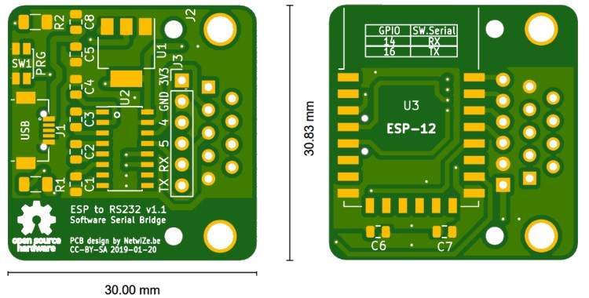

# ESP-to-RS232

## Introduction

This is an ESP to RS232 adapter that can communicate with a RS232 serial device using the MQTT protocol.
The functionality depends on the software running on the ESP-12 module. Most firmware, like [Tasmota](https://github.com/arendst/Sonoff-Tasmota), [ESPeasy](https://github.com/letscontrolit/ESPEasy) and [ESPurna](https://github.com/xoseperez/espurna/wiki/Hardware) include a software serial bride mode.

## Goal

My LG TV has an RS232 *Service Port* that can be used to control the TV (including Power On) via the serial protocol. I initially used a Raspberry Pi with a USB to Serial adapter and it worked great.
Now it is time to integrate the TV with other Home Automation devices using MQTT and replace the Raspberry Pi with an ESP8266.

## Schema

There are 2 main components in the design: 
- The ESP-12F microcontroller that will run the [Tasmota](https://github.com/arendst/Sonoff-Tasmota) software and connect to the controller via MQTT.
- A MAX3232 to convert the TTL of the ESP to RS232 levels that the TV expects.

## Prototype

A prototype was created to test the schema and provide proof-of-concept of the functionality. The circuit was first tested on an old laptop before connecting it to the TV, just to be safe.

We experienced some issues using the stock Tasmota 6.4.1 firmware. The software serial bridge seemed to introduce some random noise into the transmitted data, resulting in scrambled messages.
The TV would not acknowledge malformed commands and they would have to be resent several times. This was not ideal... Using the hardware serial port, these issues were not present.

After some investigation, we found that the problem was with the compiler version. Using the Arduino 2.4 compiler (the default for pre-build Tasmota binaries) the issue appeared.
Switching to the Arduino 2.3 compiler, the software serial connection worked flawlessly. Hence, we just needed to re-compile the Tasmota software and the issue was gone.

## Bill of Materials

## PCB design

A custom PCB was designed for this project using KiCad. It includes all the components on a minimal footprint of 30 by 31mm, while still exposing some extra GPIOs for additional functionality.
Special care was taken to leave the antenna area of the ESP free of any components and copper traces, as recommended by the ESP datasheet.
A mirco USB port is used to provide power to the board. And an AMS1117-3.3 power regulator steps down the 5V of the mirco USB port to 3.3V used for the logical circuit.
There is a female DB9 connector, so the small adapter can be plugged directly into a serial port.

## 3D Model

Here is the 3D model that KiCad created. It is very close to reality, provided you have the 3D models of all the components. KiCad comes with a vast library of components and you can download additional models from sites like grabcad.com.

While designing the 3D preview of the PCB consantly gets updated and you can work on the details until you are happy with the design.

## PCBs

The actual PCBs have been fabricated by [aisler.net](https://aisler.net/p/YJRYRSDY). They can also fabricated the stencils needed for easy soldering of the small components. Here is the front after reflowing the SMT parts:

The final board looks like this:

When mounted in the case, the result turned out quite nice:

